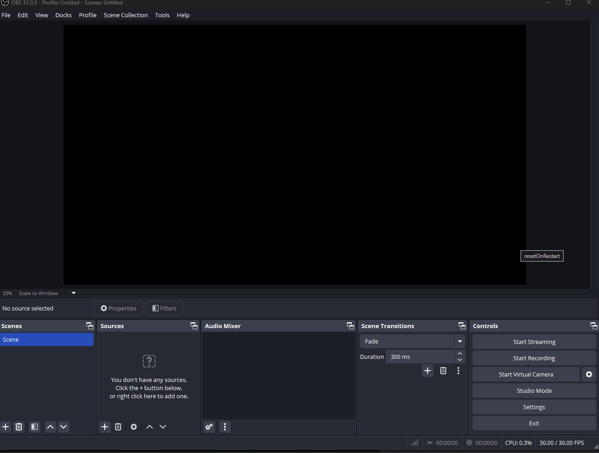

# chess-com-obs-overlay

OBS Overlay for Win/Lose/Draw and rating ±

> [!WARNING] 
> The chess.com api is pretty inconsistent and sometimes games will only show up after a short delay.

## ✨ Features

- Shows win/lose/draw and rating difference 
- Option to change between `rapid`, `blitz` and `bullet`
- Option to hide/show rating difference
- By default win/lose/draw are reset at startup, but this can be disabled
- Style is currently not customizable, but you can change the css in the html file

## 🔧 Setup

1. Download latest release [here](https://github.com/thieleju/chess-com-obs-overlay/releases)
2. Add new browser source to your OBS and select the `chess-com-obs-overlay.html` file you downloaded
3. Right click on the element and select `Inspect`
4. Click on the `0 / 0 / 0`, enter your `chess.com` username and select your desired game mode

## 🐛 Bugs

- Currently the stats will reset at the end of a month. This is due to the fact that the chess.com api only really provides one endpoint to fetch all games of a player for a specific month. (I'll probably fix this in the future so that games carry over) [reference](https://www.chess.com/news/view/published-data-api)
