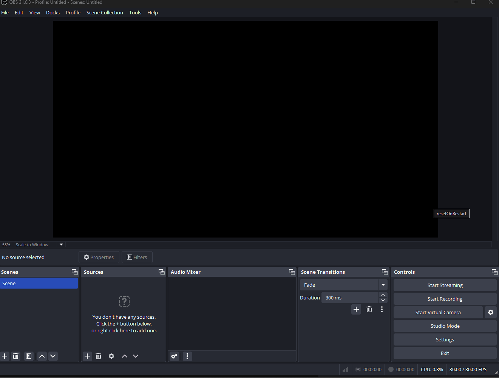

# chess-com-obs-overlay

OBS Overlay for Win/Lose/Draw and rating ±

> [!WARNING] The chess.com api is pretty inconsistent and sometimes games will only show up after a short delay.

## ✨ Features

- Shows win/lose/draw and rating difference
- Switch between `rapid`, `blitz` and `bullet`
- Switch between `W/L/D` and `W/D/L` score format
- Customize font family, line height and word spacing css properties
- Button to reset the stats
- By default win/lose/draw are reset at startup, but this can be disabled

## 🔧 Setup

1. Download latest release [here](https://github.com/thieleju/chess-com-obs-overlay/releases)
2. Add new browser source to your OBS and select the `chess-com-obs-overlay.html` file you downloaded
3. Right click on the element and select `Inspect`
4. Click on the `0 / 0 / 0`, enter your `chess.com` username and select your desired game mode



> [!NOTE] The stats will not update if the options menu is still open. You can open/close the options menu by clicking the stats as shown in the gif above.

## 📃 Chess.com API reference

- Chess.com API Documentation [here](https://www.chess.com/news/view/published-data-api) (It's pretty much discontinued sadly)

## 🛡️ CORS in OBS (Important)

When this project is used as a bundled `html` file in OBS, browser CORS rules still apply. Direct calls to `https://www.chess.com/*` and `https://api.chess.com/*` can fail depending on endpoint headers.

### Proxy setup used in this repo

This repo is configured to always use the Cloudflare Worker proxy in both `pnpm dev` and production builds.

Current proxy base URL:

- `https://obs-overlay.thieleju.workers.dev`

A ready-to-deploy worker source is included at `proxy/cloudflare-worker.js`.

Build command:

```bash
pnpm run build-only
```

The overlay calls:

- `https://obs-overlay.thieleju.workers.dev/callback/games/extended-archive`
- `https://obs-overlay.thieleju.workers.dev/pub/player/:username/stats`
